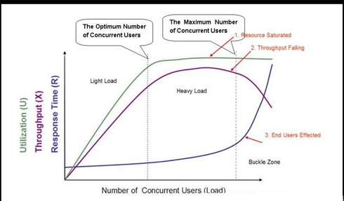

# # week 7 作业

## 题目1：性能压测的时候，随着并发压力的增加，系统响应时间和吞吐量如何变化，为什么？

首先，需要知道，吞吐量、响应时间、与并发的关系如下面公式。

> 吞吐量 = ( 1000 / 响应时间ms ) × 并发数

随着并发压力增加，吞吐量会先升高，达到峰值后会逐步降低，如果负载过高可能导致系统崩溃、那此时的吞吐量就会是0。相应的，根据上面公式可以看出，吞吐量一定的时候，并发数增加，分给单个线程的资源变少，会导致系统响应时间变长，如果并发过高、系统崩溃，那此时的响应时间就是无限了~.~

原因：

- 在并发数较低时，系统负载能力要高于当前并发数量，资源比较充足，此时并发数逐渐增加，系统仍能迅速处理，因而吞吐量会逐步增大，此时响应时间不会有太大变化，但由于资源逐步紧缺，响应时间会有缓慢增加的趋势；
- 当并发数到达一定数量、超过系统负载能力，此时系统吞吐量到达最大值，并发数继续增大时，吞吐量不会有明显变化，但响应时间开始明显增加；
- 一旦并发数超过某个阈值，将导致系统崩溃，无法及时处理用户请求，导致服务雪崩，性能急剧下降，吞吐量下降，响应时间快速上升。

因此有了如下图：




## 题目2：实现性能压测工具

用你熟悉的编程语言写一个 Web 性能压测工具，输入参数：URL，请求总次数，并发数。输出参数：平均响应时间，95% 响应时间。用这个测试工具以 10 并发、100 次请求压测 www.baidu.com。

### 实现思路

- 定义线程池来实现并发请求。
- 使用HTTP异步发送请求，发送前分配一个请求ID，并将<请求ID，发送时间>记录到一个map中；收到响应后根据请求ID、当前时间算出响应耗时，将<请求ID，响应耗时>保存到另一个map中，备用。
- 定义一个CountDownLatch，latch个数为请求总数，每次收到HTTP响应时countDown一下，确保所有请求都结束后才会执行统计操作。上述实现在`StressTester`的`startTest()`方法中。
- `printRespCostSummary()`方法汇总所有数据，计算响应平均值，然后利用一个数组保存所有响应时间、排序后，取第 (请求总数*0.95) 位置的响应数即为 95分位数。

### 程序使用

在IDEA运行`com.prayerlaputa.week7.stresstester.StressTester`即可，注意需要加入启动参数`https://www.baidu.com/ 100 10` ，表示压测URL、请求总次数、并发数，若参数不够会直接退出。

输出结果如下：

```text
压测参数：
URL: https://www.baidu.com/
总请求数量: 100
并发请求数: 10

开始测试....
测试结束，总共用时：988 ms
请求成功数量：100
平均响应时间: 678.84 ms
95分位值：522 ms
```