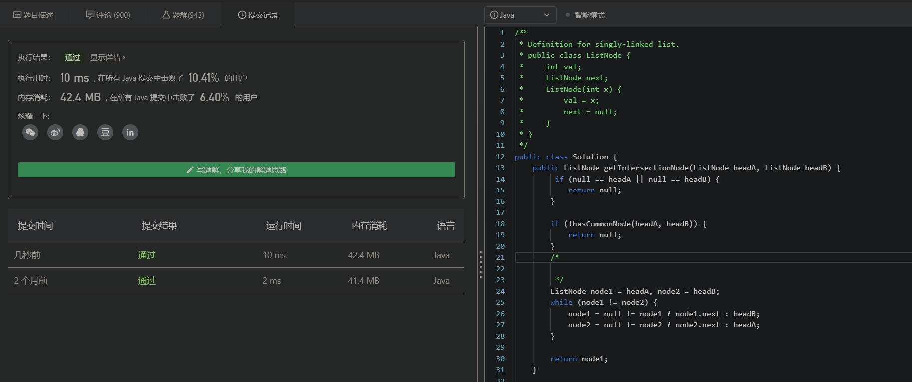

## 说明  

### 题目说明

以下题目2选1。

1、有两个单向链表（链表长度分别为 m，n），这两个单向链表有可能在某个元素合并，也可能不合并，如下图所示的这样。现在给定两个链表的头指针，在不修改链表的情况下，如何快速地判断这两个链表是否合并？如果合并，找到合并的元素，也就是图中的 x 元素。请用代码（或伪代码）描述算法，并给出时间复杂度。

2、请画出 DataNode 服务器节点宕机的时候，HDFS 的处理过程时序图。

### 解答  

#### 算法题目解答  

本题目为leetcode 160 Intersection Of Two LinkedList  (https://leetcode-cn.com/problems/intersection-of-two-linked-lists/) 的简单变种，不同之处在于，题目中明确说明两条链表可能相交也可能不相交。  

所以为了保证求解正常，**需要先判断两个链表是否相交**。

有关相交的判断有以下算法：
1. 两条链表都遍历到尾节点，判断尾节点是否为同一个节点，如果是则两者相交。因为如果两个没有环的链表相交于某一节点，那么在这个节点之后的所有节点都是两个链表共有的。时间O(N)，空间O(1)     
2. 使用一个set保存链表1的所有节点，然后遍历链表2，链表2中只要有一个节点在set中，就说明两者相交。时间O(N), 空间O(N)   
3. 将链表1的尾节点指向链表2的头节点，然后从链表1头节点开始遍历，采用快慢指针的思路判断链表1是否有环，若有则说明两者相交。时间O(N)，空间O(1)   
4. 假设两个链表都有环，情况只有2种：相交于”环上”或相交于”不是环的部分”。因此环一定是在公共部分上的。假如知道其中一个链表上环的任意一个节点，则只需要判断是否在另一个链表上就行了。

此处我选择了相对容易实现的引入一个set的方案2。   

若2个链表相交，我们继续寻找两条链表的第一个交点，此时又有多种算法可以解答：
1. 仍然是利用一个set保存链表1的所有节点，然后遍历链表2，第一个能在set中找到的节点即为所求。时间O(N) 空间O(N)  
2. 分别计算链表1、链表2的长度，得到两者长度差delta，然后相对比较长的链表先遍历delta个节点，保证两者剩余需遍历的节点个数相同，然后两个链表开始遍历，同时比较当前节点，第一个相同的节点即为所求。时间O(N) 空间O(1)   
3. 相对巧妙一些，是方案2的进一步优化：在已知链表1、链表2肯定有公共部分的前提下，分别使用指针1遍历链表1，指针2遍历链表2，当遍历到链表尽头时，交换链表、继续遍历，比如指针1遍历完链表1之后，换到链表2的表头继续遍历链表2，同时需要比较指针1、指针2是否是同一个节点，相同则说明找到所求节点。
    - 原理：通过两个指针分别遍历两个链表，使得指针走过的长度是相同的，那么这两个指针最后必然会同时走到尽头。而两个链表有公共部分，那么在两个链表第一个公共节点处两个指针必然第一次相遇。
    
此处我选择了方案3来实现，代码比较简洁。
    
使用leetcode-cn.com测试结果如下：
主要是利用leetcode的测试用例验证正确性，算法速度的话，由于额外加入了判断两个链表是否相交的逻辑，必然比leetcode 160一般的解答要慢不少。

